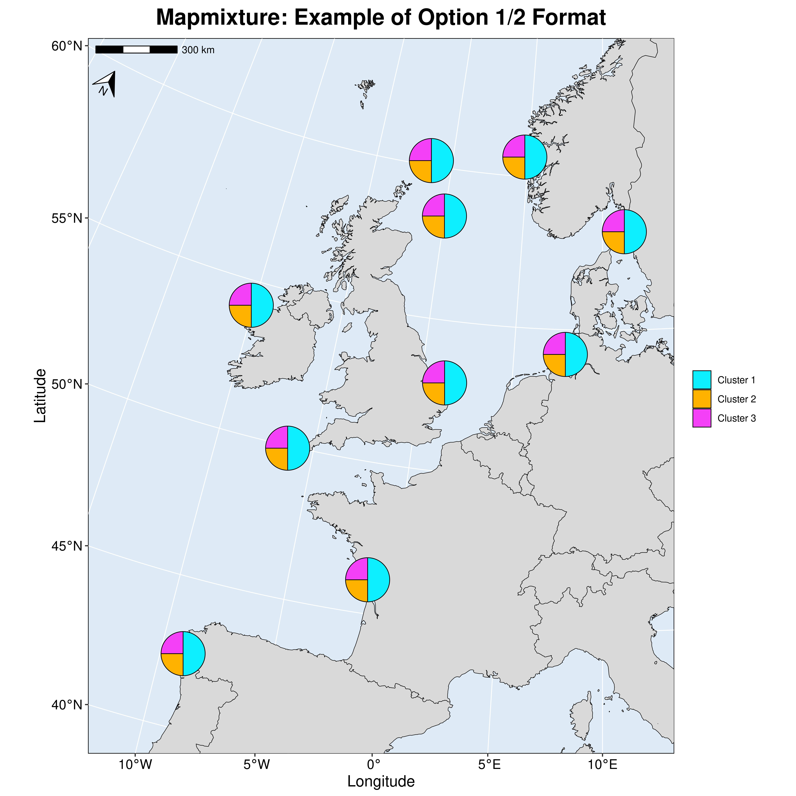
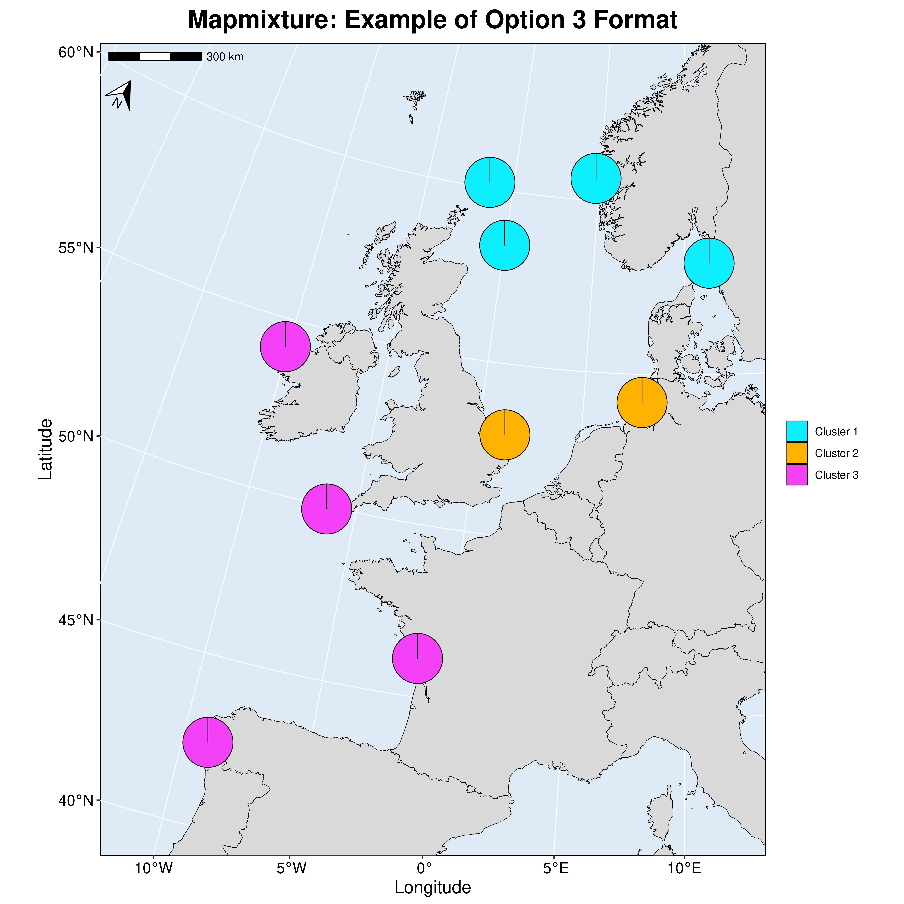

# Mapmixture

Mapmixture allows users to visualise admixture as pie charts on a map. Users upload admixture proportions for each individual or site, and a coordinates file containing location data. In data sets where there are multiple individuals per site, the software will calculate the average admixture proportion for each site.

<p class="float-left">

 

</p>

## Link to online shiny web server

<a href="https://tomjenkins.shinyapps.io/mapmixture/" target="_blank">tomjenkins.shinyapps.io/Mapmixture</a>

## Setup locally

### Windows

-   Download and install [RStudio](https://posit.co/download/rstudio-desktop/) and [R v4.2.0](https://cran.r-project.org/bin/windows/base/old/4.2.0/)
-   Download a [zip file](https://github.com/Tom-Jenkins/Mapmixture/archive/refs/heads/main.zip) of Mapmixture main repo and extract files
-   In RStudio, open the RhinoApp.Rproj project file
-   Install `renv` package from CRAN (`install.packages("renv")`)
-   In the R console type `renv::restore()`
-   Launch Mapmixture shiny app using `shiny::runApp()`

### Linux

Clone repo to current directory

```         
git clone https://github.com/Tom-Jenkins/Mapmixture.git
cd Mapmixture/
```

Start R (tested with R v4.2.0)

```         
R
```

Type the following into the R console to restore R packages and versions

```         
install.packages("renv")
renv::restore()
```

Launch Mapmixture shiny app

```         
shiny::runApp()
```
