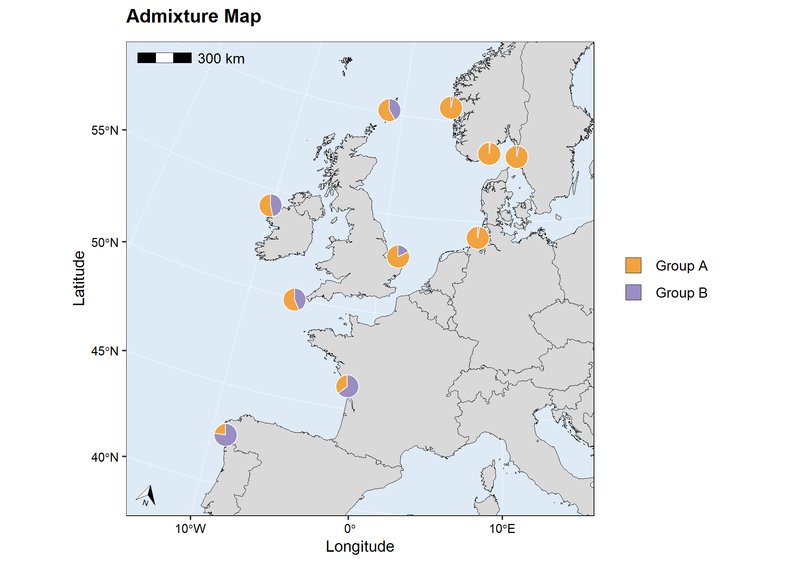

<!-- README.md is generated from README.Rmd. Please edit that file -->

# mapmixture

<!-- badges: start -->

[](https://github.com/Tom-Jenkins/mapmixture/actions/workflows/R-CMD-check.yaml)
[](https://app.codecov.io/gh/Tom-Jenkins/mapmixture?branch=main)
<!-- badges: end -->

`mapmixture` is an R package and shiny app that enables users to
visualise admixture as pie charts on a projected map. It also allows
users to visualise admixture as traditional structure barplots or facet
barplots.

## Installation

You need to have [R](https://www.r-project.org/) (\>= 4.1.0) installed
on your system. Click
[here](https://cran.r-project.org/bin/windows/base/) to download the
latest version of R for Windows.

Install the latest development version from GitHub:

``` r
# install.packages("devtools")
devtools::install_github("Tom-Jenkins/mapmixture")
```

## Examples

Standard usage of `mapmixture()`:

``` r
# Load package
library(mapmixture)

# Read in admixture file format 1
file <- system.file("extdata", "admixture1.csv", package = "mapmixture")
admixture1 <- read.csv(file)

# Read in coordinates file
file <- system.file("extdata", "coordinates.csv", package = "mapmixture")
coordinates <- read.csv(file)

# Run mapmixture
map1 <- mapmixture(admixture1, coordinates, crs = 3035)
map1
```


Customised usage of `mapmixture()`:

``` r
# Load package
library(mapmixture)

# Read in admixture file format 3
file <- system.file("extdata", "admixture3.csv", package = "mapmixture")
admixture3 <- read.csv(file)

# Read in coordinates file
file <- system.file("extdata", "coordinates.csv", package = "mapmixture")
coordinates <- read.csv(file)

# Run mapmixture
map2 <- mapmixture(admixture3, coordinates,
  cluster_cols = c("blue","green"),
  cluster_names = c("Group A","Group B"),
  crs = 3035,
  boundary = c(xmin=-15, xmax=16, ymin=40, ymax=62),
  pie_size = 1,
  pie_border = 0.3,
  pie_opacity = 1,
  land_colour = "#d9d9d9",
  sea_colour = "#deebf7",
  expand = TRUE,
  arrow = TRUE,
  arrow_size = 1.5,
  arrow_position = "tl",
  scalebar = TRUE,
  scalebar_size = 1.5,
  scalebar_position = "tl",
  plot_title = "Mapmixture Figure",
  plot_title_size = 12,
  axis_title_size = 10,
  axis_text_size = 8
)
map2
```


Add additional geoms or theme options to `mapmixture()` ggplot object:

``` r
# Load packages
library(mapmixture)
library(ggplot2)

# Read in admixture file format 1
file <- system.file("extdata", "admixture1.csv", package = "mapmixture")
admixture1 <- read.csv(file)

# Read in coordinates file
file <- system.file("extdata", "coordinates.csv", package = "mapmixture")
coordinates <- read.csv(file)

# Run mapmixture
map3 <- mapmixture(admixture1, coordinates,
  cluster_cols = c("#91bfdb","#fc8d59"),
  cluster_names = c("Ancestry 1","Ancestry 2"),
  crs = 4326,
  boundary = c(xmin=-15, xmax=16, ymin=40, ymax=62),
  pie_size = 2,
)+
  # Add additional label to the map
  annotate("label",
    x = -10,
    y = 46.5,
    label = "Atlantic Ocean",
    size = 3,
  )+
  # Add additional text to the map
  annotate("text",
    x = 2.5,
    y = 57,
    label = "North Sea",
    size = 3,
  )+
  # Adjust ggplot theme options
  theme(
    axis.title = element_text(size = 10),
    axis.text = element_text(size = 8),
  )+
  # Adjust the size of the legend keys
  guides(fill = guide_legend(override.aes = list(size = 5)))
map3
#> Scale on map varies by more than 10%, scale bar may be inaccurate
```


Combine admixture mapmixture and barplot ggplot objects into a single
figure:

``` r
# Load packages
library(mapmixture)
library(ggplot2)
library(gridExtra)

# Read in admixture file format 1
file <- system.file("extdata", "admixture1.csv", package = "mapmixture")
admixture1 <- read.csv(file)

# Read in coordinates file
file <- system.file("extdata", "coordinates.csv", package = "mapmixture")
coordinates <- read.csv(file)

# Run mapmixture
map4 <- mapmixture(admixture1, coordinates,
  cluster_cols = c("#91bfdb","#fc8d59"),
  cluster_names = c("Ancestry 1","Ancestry 2"),
  crs = 4326,
  boundary = c(xmin=-20, xmax=20, ymin=40, ymax=62),
  pie_size = 2.5,
)+
  # Adjust theme options
  theme(
    legend.position = "top",
  )+
  # Adjust the size of the legend keys
  guides(fill = guide_legend(override.aes = list(size = 5)))

# Traditional structure barplot
structure_barplot <- structure_plot(admixture1,
  type = "structure",
  cluster_cols = c("#91bfdb","#fc8d59"),
  site_dividers = TRUE,
  labels = "site",
  flip_axis = FALSE,
  site_ticks_size = -0.05,
  site_labels_y = -0.35,
  site_labels_size = 2.5
)+
  # Adjust theme options
  theme(
    axis.title.y = element_text(size = 8, hjust = 1),
    axis.text.y = element_text(size = 5),
  )

# Arrange plots
grid.arrange(map4, structure_barplot, nrow = 2, heights = c(4,1))
#> Scale on map varies by more than 10%, scale bar may be inaccurate
```



``` r

# Facet structure barplot
facet_barplot <- structure_plot(admixture1,
  type = "facet",
  cluster_cols = c("#91bfdb","#fc8d59"),
  facet_col = 2,
  ylabel = "Admixture proportions",
)+
  theme(
    axis.title.y = element_text(size = 10),
    axis.text.y = element_text(size = 5),
    strip.text = element_text(size = 6, vjust = 1, margin = margin(t=1.5, r=0, b=1.5, l=0)),
  )

# Arrange plots
grid.arrange(map4, facet_barplot, ncol = 2, widths = c(3,2))
#> Scale on map varies by more than 10%, scale bar may be inaccurate
```


## Interactive shiny web application

``` r
# Load package
library(mapmixture)

# Launch shiny app
launch_mapmixture()
```

## Format

``` r
# Load package
library(mapmixture)

# Admixture Format 1
file <- system.file("extdata", "admixture1.csv", package = "mapmixture")
admixture1 <- read.csv(file)
head(admixture1)
#>     Site   Ind Cluster1 Cluster2
#> 1 Bergen Ber01   0.9999    1e-04
#> 2 Bergen Ber02   0.9999    1e-04
#> 3 Bergen Ber03   0.9999    1e-04
#> 4 Bergen Ber04   0.9999    1e-04
#> 5 Bergen Ber05   0.9999    1e-04
#> 6 Bergen Ber06   0.9999    1e-04

# Admixture Format 2
file <- system.file("extdata", "admixture2.csv", package = "mapmixture")
admixture2 <- read.csv(file)
admixture2
#>                Site              Ind  Cluster1   Cluster2
#> 1            Bergen           Bergen 0.9675212 0.03247879
#> 2            Cromer           Cromer 0.8217114 0.17828857
#> 3        Flodevigen       Flodevigen 0.9843806 0.01561944
#> 4         Helgoland        Helgoland 0.9761543 0.02384571
#> 5         Ile de Re        Ile de Re 0.3529000 0.64710000
#> 6   Isles of Scilly  Isles of Scilly 0.5632444 0.43675556
#> 7           Lysekil          Lysekil 0.9661722 0.03382778
#> 8  Mullet Peninsula Mullet Peninsula 0.5316833 0.46831667
#> 9          Shetland         Shetland 0.5838028 0.41619722
#> 10             Vigo             Vigo 0.2268444 0.77315556

# Admixture Format 3
file <- system.file("extdata", "admixture3.csv", package = "mapmixture")
admixture3 <- read.csv(file)
admixture3
#>                Site              Ind Cluster1 Cluster2
#> 1            Bergen           Bergen        1        0
#> 2            Cromer           Cromer        1        0
#> 3        Flodevigen       Flodevigen        1        0
#> 4         Helgoland        Helgoland        1        0
#> 5         Ile de Re        Ile de Re        0        1
#> 6   Isles of Scilly  Isles of Scilly        1        0
#> 7           Lysekil          Lysekil        1        0
#> 8  Mullet Peninsula Mullet Peninsula        1        0
#> 9          Shetland         Shetland        1        0
#> 10             Vigo             Vigo        0        1

# Coordinates
file <- system.file("extdata", "coordinates.csv", package = "mapmixture")
coordinates <- read.csv(file)
coordinates
#>                Site   Lat    Lon
#> 1            Bergen 60.65   4.77
#> 2            Cromer 52.94   1.31
#> 3        Flodevigen 58.42   8.76
#> 4         Helgoland 54.18   7.90
#> 5         Ile de Re 46.13  -1.25
#> 6   Isles of Scilly 49.92  -6.33
#> 7           Lysekil 58.26  11.37
#> 8  Mullet Peninsula 54.19 -10.15
#> 9          Shetland 60.17  -1.40
#> 10             Vigo 42.49  -8.99
```
