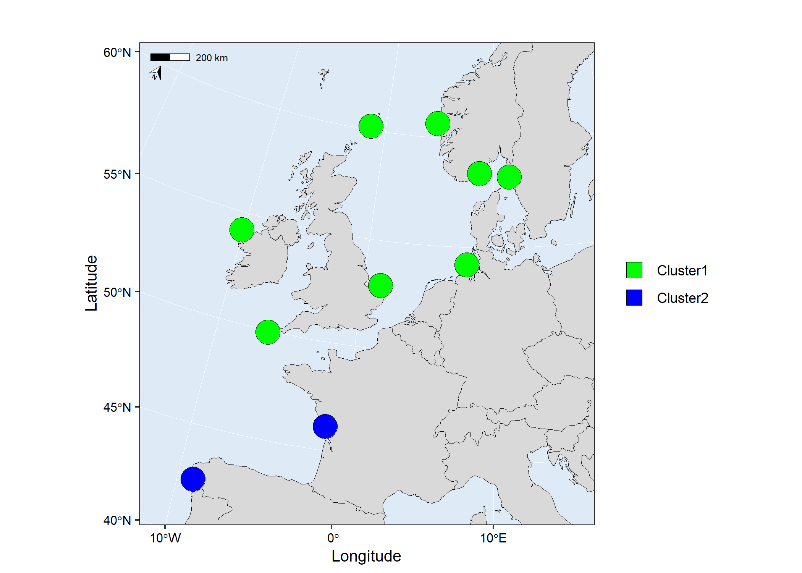
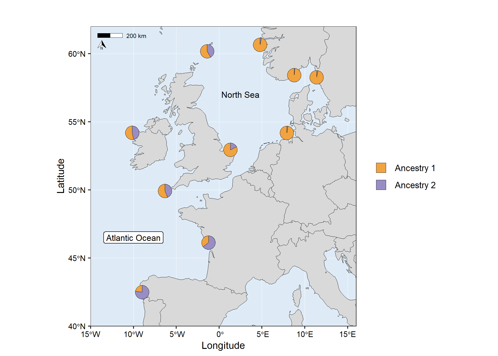
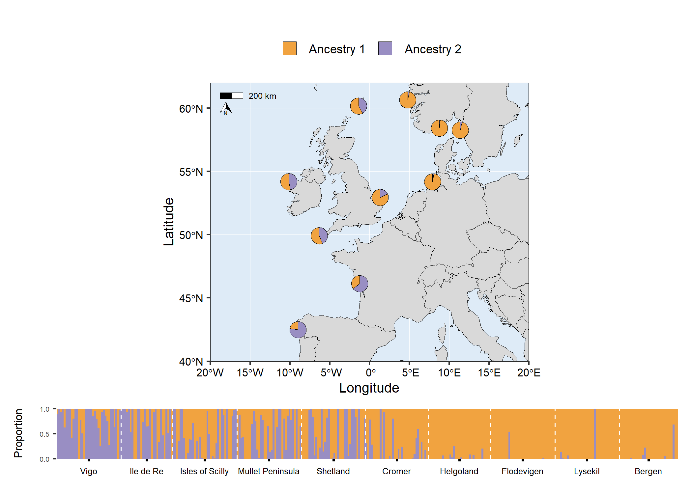
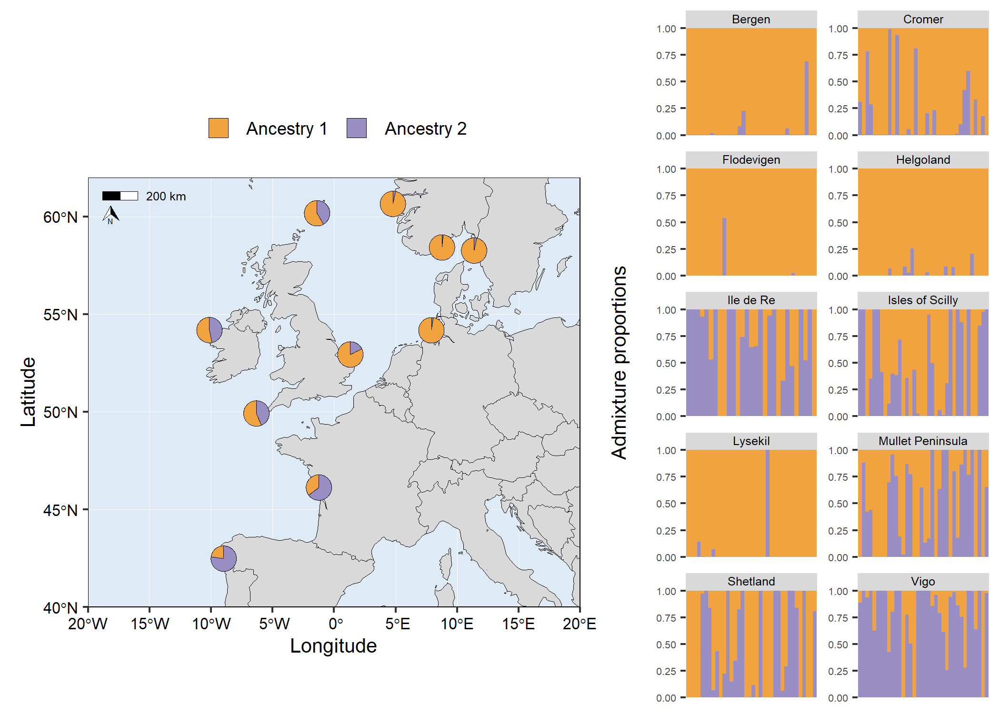
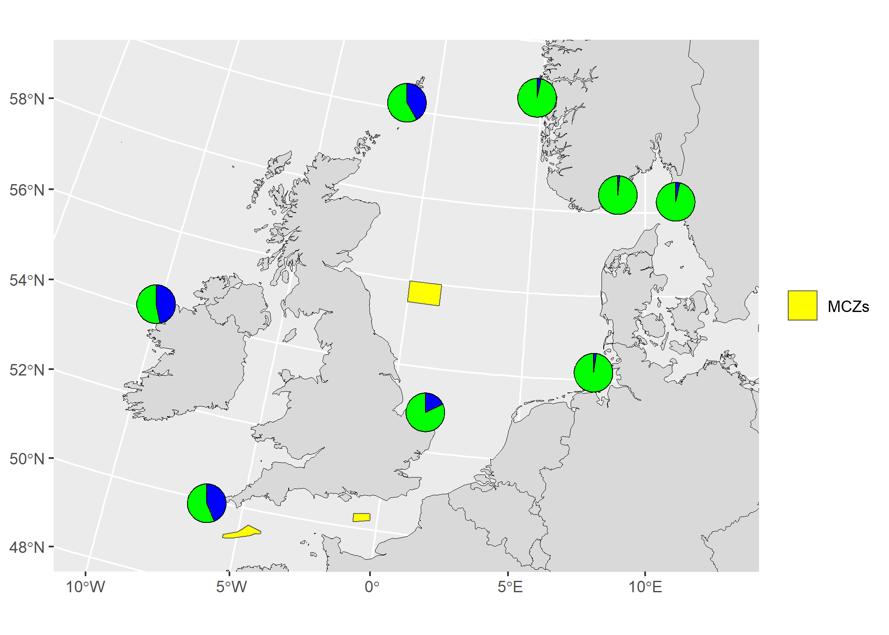

<!-- README.md is generated from README.Rmd. Please edit that file -->

# mapmixture

<!-- badges: start -->

[](https://github.com/Tom-Jenkins/mapmixture/actions/workflows/R-CMD-check.yaml)
<!-- [](https://app.codecov.io/gh/Tom-Jenkins/mapmixture?branch=main) -->
<!-- badges: end -->

`mapmixture` is an R package and Shiny app that enables users to
visualise admixture as pie charts on a projected map. It also allows
users to visualise admixture as traditional structure barplots or facet
barplots.

## Installation

`mapmixture` requires [R](https://www.r-project.org/) (\>= 4.1.0) to be
installed on your system. Click
[here](https://cran.r-project.org/bin/windows/base/) to download the
latest version of R for Windows.

Install the latest development version from GitHub:

``` r
# install.packages("devtools")
devtools::install_github("Tom-Jenkins/mapmixture")
```

## Reference

``` r
mapmixture()         # main function
structure_plot()     # plot traditional structure or facet barplot
scatter_plot()       # plot PCA or DAPC results
launch_mapmixture()  # launch mapmixture Shiny app
```

## Citation

Jenkins TL (*in press*). <span class="smallcaps">mapmixture</span>: an R
package and web app for spatial visualisation of admixture and
population structure, *Molecular Ecology Resources*. DOI:
10.1111/1755-0998.13943.

## Examples

#### Basic usage of mapmixture

<details>
<summary>
Code
</summary>

``` r
# Load package
library(mapmixture)

# Read in admixture file format 1
file <- system.file("extdata", "admixture1.csv", package = "mapmixture")
admixture1 <- read.csv(file)

# Read in coordinates file
file <- system.file("extdata", "coordinates.csv", package = "mapmixture")
coordinates <- read.csv(file)

# Run mapmixture
map1 <- mapmixture(admixture1, coordinates, crs = 3035)
# map1
```

</details>


#### Customised usage of mapmixture

<details>
<summary>
Code
</summary>

``` r
# Load package
library(mapmixture)

# Read in admixture file format 3
file <- system.file("extdata", "admixture3.csv", package = "mapmixture")
admixture3 <- read.csv(file)

# Read in coordinates file
file <- system.file("extdata", "coordinates.csv", package = "mapmixture")
coordinates <- read.csv(file)

# Run mapmixture
map2 <- mapmixture(
  admixture_df = admixture3,
  coords_df = coordinates,
  cluster_cols = c("green","blue"),
  cluster_names = c("Group A","Group B"),
  crs = 3035,
  boundary = c(xmin=-15, xmax=16, ymin=40, ymax=62),
  pie_size = 1,
  pie_border = 0.3,
  pie_opacity = 1,
  land_colour = "#d9d9d9",
  sea_colour = "#deebf7",
  expand = TRUE,
  arrow = TRUE,
  arrow_size = 1.5,
  arrow_position = "bl",
  scalebar = TRUE,
  scalebar_size = 1.5,
  scalebar_position = "tl",
  plot_title = "Admixture Map",
  plot_title_size = 12,
  axis_title_size = 10,
  axis_text_size = 8
)
# map2
```

</details>


#### Add additional geoms or theme options to mapmixture ggplot object

<details>
<summary>
Code
</summary>

``` r
# Load packages
library(mapmixture)
library(ggplot2)

# Read in admixture file format 1
file <- system.file("extdata", "admixture1.csv", package = "mapmixture")
admixture1 <- read.csv(file)

# Read in coordinates file
file <- system.file("extdata", "coordinates.csv", package = "mapmixture")
coordinates <- read.csv(file)

# Run mapmixture
map3 <- mapmixture(
  admixture_df = admixture1,
  coords_df = coordinates,
  cluster_cols = c("#f1a340","#998ec3"),
  cluster_names = c("Ancestry 1","Ancestry 2"),
  crs = 4326,
  boundary = c(xmin=-15, xmax=16, ymin=40, ymax=62),
  pie_size = 2,
)+
  # Add additional label to the map
  annotate("label",
    x = -10,
    y = 46.5,
    label = "Atlantic Ocean",
    size = 3,
  )+
  # Add additional text to the map
  annotate("text",
    x = 2.5,
    y = 57,
    label = "North Sea",
    size = 3,
  )+
  # Adjust ggplot theme options
  theme(
    axis.title = element_text(size = 10),
    axis.text = element_text(size = 8),
  )+
  # Adjust the size of the legend keys
  guides(fill = guide_legend(override.aes = list(size = 5, alpha = 1)))
# map3
```

</details>



#### Combine admixture map and barplot ggplot objects into a single figure

<details>
<summary>
Code
</summary>

``` r
# Load packages
library(mapmixture)
library(ggplot2)
library(gridExtra)

# Read in admixture file format 1
file <- system.file("extdata", "admixture1.csv", package = "mapmixture")
admixture1 <- read.csv(file)

# Read in coordinates file
file <- system.file("extdata", "coordinates.csv", package = "mapmixture")
coordinates <- read.csv(file)

# Run mapmixture
map4 <- mapmixture(
  admixture_df = admixture1,
  coords_df = coordinates,
  cluster_cols = c("#f1a340","#998ec3"),
  cluster_names = c("Ancestry 1","Ancestry 2"),
  crs = 4326,
  boundary = c(xmin=-20, xmax=20, ymin=40, ymax=62),
  pie_size = 2.5,
)+
  # Adjust theme options
  theme(
    legend.position = "top",
    plot.margin = margin(l = 10, r = 10),
  )+
  # Adjust the size of the legend keys
  guides(fill = guide_legend(override.aes = list(size = 5, alpha = 1)))

# Traditional structure barplot
structure_barplot <- structure_plot(
  admixture_df = admixture1,
  type = "structure",
  cluster_cols = c("#f1a340","#998ec3"),
  site_dividers = TRUE,
  divider_width = 0.4,
  site_order = c(
    "Vigo","Ile de Re","Isles of Scilly","Mullet Peninsula",
    "Shetland","Cromer","Helgoland","Flodevigen","Lysekil","Bergen"
  ),
  labels = "site",
  flip_axis = FALSE,
  site_ticks_size = -0.05,
  site_labels_y = -0.35,
  site_labels_size = 2.2
)+
  # Adjust theme options
  theme(
    axis.title.y = element_text(size = 8, hjust = 1),
    axis.text.y = element_text(size = 5),
  )

# Arrange plots
# grid.arrange(map4, structure_barplot, nrow = 2, heights = c(4,1))
```

</details>



<details>
<summary>
Code
</summary>

``` r
# Load packages
library(mapmixture)
library(ggplot2)
library(gridExtra)

# Read in admixture file format 1
file <- system.file("extdata", "admixture1.csv", package = "mapmixture")
admixture1 <- read.csv(file)

# Read in coordinates file
file <- system.file("extdata", "coordinates.csv", package = "mapmixture")
coordinates <- read.csv(file)

# Run mapmixture
map4 <- mapmixture(
  admixture_df = admixture1,
  coords_df = coordinates,
  cluster_cols = c("#f1a340","#998ec3"),
  cluster_names = c("Ancestry 1","Ancestry 2"),
  crs = 4326,
  boundary = c(xmin=-20, xmax=20, ymin=40, ymax=62),
  pie_size = 2.5,
)+
  # Adjust theme options
  theme(
    legend.position = "top",
    plot.margin = margin(l = 10, r = 10),
  )+
  # Adjust the size of the legend keys
  guides(fill = guide_legend(override.aes = list(size = 5, alpha = 1)))

# Facet structure barplot
facet_barplot <- structure_plot(admixture1,
  type = "facet",
  cluster_cols = c("#f1a340","#998ec3"),
  facet_col = 2,
  ylabel = "Admixture proportions",
)+
  theme(
    axis.title.y = element_text(size = 10),
    axis.text.y = element_text(size = 5),
    strip.text = element_text(size = 6, vjust = 1, margin = margin(t=1.5, r=0, b=1.5, l=0)),
  )

# Arrange plots
# grid.arrange(map4, facet_barplot, ncol = 2, widths = c(3,2))
```

</details>



#### Use a raster as the basemap

The raster (TIFF) used in the example below was downloaded from Natural
Earth
[here](https://www.naturalearthdata.com/downloads/50m-raster-data/50m-natural-earth-1/).
You need to install the [terra](https://github.com/rspatial/terra)
package to use this feature. Currently, the `basemap` argument accepts a
`SpatRaster` or a `sf` object.

<details>
<summary>
Code
</summary>

``` r
# Load packages
library(mapmixture)
library(terra)

# Create SpatRaster object
earth <- terra::rast("../NE1_50M_SR_W/NE1_50M_SR_W.tif")

# Read in admixture file format 1
file <- system.file("extdata", "admixture1.csv", package = "mapmixture")
admixture1 <- read.csv(file)

# Read in coordinates file
file <- system.file("extdata", "coordinates.csv", package = "mapmixture")
coordinates <- read.csv(file)

# Run mapmixture
map5 <- mapmixture(admixture1, coordinates, crs = 3035, basemap = earth)
# map5
```

</details>



#### Add pie charts to an existing map

The vector data (shapefile) used in the example below was downloaded
from the Natural England Open Data Geoportal
[here](https://naturalengland-defra.opendata.arcgis.com/datasets/Defra::marine-conservation-zones-england/explore?location=53.749917%2C-5.534585%2C6.27).

<details>
<summary>
Code
</summary>

``` r
# Load packages
library(mapmixture)
library(ggplot2)
library(dplyr)
library(sf)

# Read in admixture file format 1
file <- system.file("extdata", "admixture1.csv", package = "mapmixture")
admixture1 <- read.csv(file)

# Read in coordinates file
file <- system.file("extdata", "coordinates.csv", package = "mapmixture")
coordinates <- read.csv(file)

# Parameters
crs <- 3035
boundary <- c(xmin=-11, xmax=13, ymin=50, ymax=60) |> transform_bbox(bbox = _, crs)

# Read in world coastlines and transform to CRS
file <- system.file("extdata", "world.gpkg", package = "mapmixture")
world <- st_read(file, quiet = TRUE) |> st_transform(x = _, crs = crs)

# Read in Marine Conservation Zones shapefile
# Extract polygons for Western Channel, Offshore Brighton and Swallow Sand
# Transform to CRS
mczs <- st_read("../Marine_Conservation_Zones_England/Marine_Conservation_Zones___Natural_England_and_JNCC.shp", quiet = TRUE) |>
  dplyr::filter(.data = _, MCZ_NAME %in% c("Western Channel", "Offshore Brighton", "Swallow Sand")) |>
  st_transform(x = _, crs = crs)

# Run mapmixture helper functions to prepare admixture and coordinates data
admixture_df <- standardise_data(admixture1, type = "admixture") |> transform_admix_data(data = _)
coords_df <- standardise_data(coordinates, type = "coordinates")
admix_coords <- merge_coords_data(coords_df, admixture_df) |> transform_df_coords(df = _, crs = crs)

# Plot map and add pie charts
map6 <- ggplot()+
  geom_sf(data = world, colour = "black", fill = "#d9d9d9", size = 0.1)+
  geom_sf(data = mczs, aes(fill = "MCZs"), linewidth = 0.3)+
  scale_fill_manual(values = c("yellow"))+
  coord_sf(
    xlim = c(boundary[["xmin"]], boundary[["xmax"]]),
    ylim = c(boundary[["ymin"]], boundary[["ymax"]])
  )+
  add_pie_charts(admix_coords,
    admix_columns = 4:ncol(admix_coords),
    lat_column = "lat",
    lon_column = "lon",
    pie_colours = c("green","blue"),
    border = 0.3,
    opacity = 1,
    pie_size = 0.8
  )+
  theme(
    legend.title = element_blank(),
  )
# map6
```

</details>


#### Scatter plot of PCA or DAPC results from genotypes

<details>
<summary>
Code
</summary>

``` r
# Load packages
library(mapmixture)
library(ggplot2)
library(adegenet)
library(RColorBrewer)
library(gridExtra)

# Load example genotypes
data("dapcIllus")
geno = dapcIllus$a

# Change population labels
popNames(geno) = c("Pop1","Pop2","Pop3","Pop4","Pop5","Pop6")

# Region names
region_names <- rep(c("Region1", "Region2"), each = 300)

# Define colour palette
cols = brewer.pal(nPop(geno), "RdYlBu")

# Perform PCA
pca1 = dudi.pca(geno, scannf = FALSE, nf = 3)

# Percent of genetic variance explained by each axis
percent = round(pca1$eig/sum(pca1$eig)*100, digits = 1)

# Scatter plot with centroids and segments
scatter1 <- scatter_plot(
  dataframe = pca1$li,
  group_ids = geno$pop,
  type = "points",
  axes = c(1,2),
  percent = percent,
  colours = cols,
  point_size = 2,
  point_type = 21,
  centroid_size = 2,
  stroke = 0.1,
  plot_title = "PCA coloured by group_ids"
)+
  theme(
    legend.position = "none",
    axis.title = element_text(size = 8),
    axis.text = element_text(size = 6),
    plot.title = element_text(size = 10),
  )

# Same as scatter1 but no segments and axis 1 and 3 are shown
scatter2 <- scatter_plot(
  dataframe = pca1$li,
  group_ids = geno$pop,
  type = "points",
  axes = c(1,3),
  percent = percent,
  colours = cols,
  point_size = 2,
  point_type = 21,
  centroids = TRUE,
  centroid_size = 2,
  segments = FALSE,
  stroke = 0.1,
  plot_title = "PCA no segments and axis 1 and 3 shown"
)+
  theme(
    legend.position = "none",
    axis.title = element_text(size = 8),
    axis.text = element_text(size = 6),
    plot.title = element_text(size = 10),
  )

# Same as scatter1 but coloured by region
scatter3 <- scatter_plot(
  dataframe = pca1$li,
  group_ids = geno$pop,
  other_group = region_names,
  type = "points",
  axes = c(1,2),
  percent = percent,
  colours = cols,
  point_size = 2,
  point_type = 21,
  centroid_size = 2,
  stroke = 0.1,
  plot_title = "PCA coloured by other_group"
)+
  theme(
    legend.position = "none",
    axis.title = element_text(size = 8),
    axis.text = element_text(size = 6),
    plot.title = element_text(size = 10),
  )

# Scatter plot with labels instead of points
scatter4 <- scatter_plot(
  dataframe = pca1$li,
  group_ids = geno$pop,
  type = "labels",
  labels = rownames(pca1$li),
  colours = cols,
  size = 2,
  label.size = 0.10,
  label.padding = unit(0.10, "lines"),
  plot_title = "PCA using labels instead of points"
)+
  theme(
    legend.position = "none",
    axis.title = element_text(size = 8),
    axis.text = element_text(size = 6),
    plot.title = element_text(size = 10),
  )

# Arrange plots
# grid.arrange(scatter1, scatter2, scatter3, scatter4)
```

</details>



## Launch interactive Shiny app

``` r
# Load package
library(mapmixture)

# Launch Shiny app
launch_mapmixture()
```

## Link to online Shiny app

<https://tomjenkins.shinyapps.io/mapmixture/>

## Format

``` r
# Load package
library(mapmixture)

# Admixture Format 1
file <- system.file("extdata", "admixture1.csv", package = "mapmixture")
admixture1 <- read.csv(file)
head(admixture1)
#>     Site   Ind Cluster1 Cluster2
#> 1 Bergen Ber01   0.9999    1e-04
#> 2 Bergen Ber02   0.9999    1e-04
#> 3 Bergen Ber03   0.9999    1e-04
#> 4 Bergen Ber04   0.9999    1e-04
#> 5 Bergen Ber05   0.9999    1e-04
#> 6 Bergen Ber06   0.9999    1e-04

# Admixture Format 2
file <- system.file("extdata", "admixture2.csv", package = "mapmixture")
admixture2 <- read.csv(file)
admixture2
#>                Site              Ind  Cluster1   Cluster2
#> 1            Bergen           Bergen 0.9675212 0.03247879
#> 2            Cromer           Cromer 0.8217114 0.17828857
#> 3        Flodevigen       Flodevigen 0.9843806 0.01561944
#> 4         Helgoland        Helgoland 0.9761543 0.02384571
#> 5         Ile de Re        Ile de Re 0.3529000 0.64710000
#> 6   Isles of Scilly  Isles of Scilly 0.5632444 0.43675556
#> 7           Lysekil          Lysekil 0.9661722 0.03382778
#> 8  Mullet Peninsula Mullet Peninsula 0.5316833 0.46831667
#> 9          Shetland         Shetland 0.5838028 0.41619722
#> 10             Vigo             Vigo 0.2268444 0.77315556

# Admixture Format 3
file <- system.file("extdata", "admixture3.csv", package = "mapmixture")
admixture3 <- read.csv(file)
admixture3
#>                Site              Ind Cluster1 Cluster2
#> 1            Bergen           Bergen        1        0
#> 2            Cromer           Cromer        1        0
#> 3        Flodevigen       Flodevigen        1        0
#> 4         Helgoland        Helgoland        1        0
#> 5         Ile de Re        Ile de Re        0        1
#> 6   Isles of Scilly  Isles of Scilly        1        0
#> 7           Lysekil          Lysekil        1        0
#> 8  Mullet Peninsula Mullet Peninsula        1        0
#> 9          Shetland         Shetland        1        0
#> 10             Vigo             Vigo        0        1

# Coordinates
file <- system.file("extdata", "coordinates.csv", package = "mapmixture")
coordinates <- read.csv(file)
coordinates
#>                Site   Lat    Lon
#> 1            Bergen 60.65   4.77
#> 2            Cromer 52.94   1.31
#> 3        Flodevigen 58.42   8.76
#> 4         Helgoland 54.18   7.90
#> 5         Ile de Re 46.13  -1.25
#> 6   Isles of Scilly 49.92  -6.33
#> 7           Lysekil 58.26  11.37
#> 8  Mullet Peninsula 54.19 -10.15
#> 9          Shetland 60.17  -1.40
#> 10             Vigo 42.49  -8.99
```

## Related software

- [pophelper](https://github.com/royfrancis/pophelper)
- [pophelperShiny](https://github.com/royfrancis/pophelperShiny)
