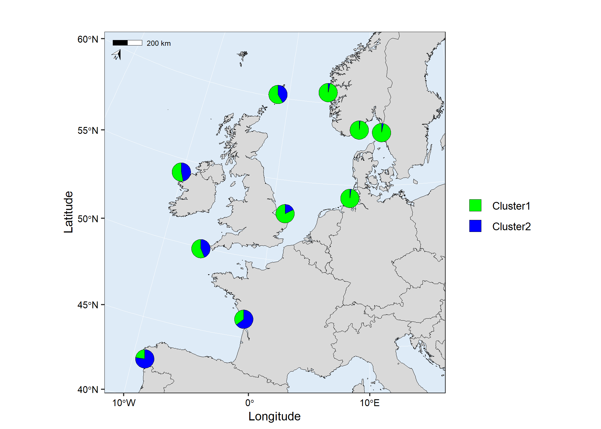
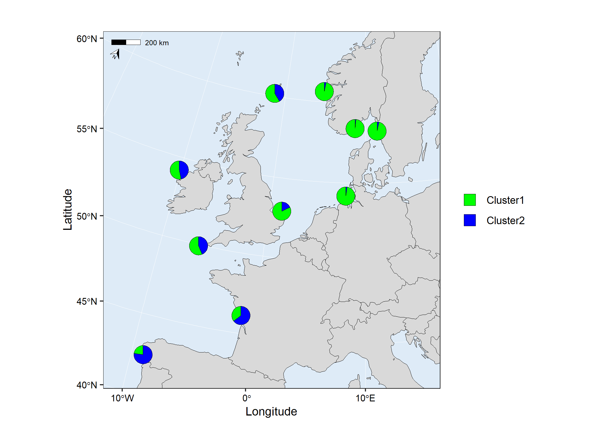
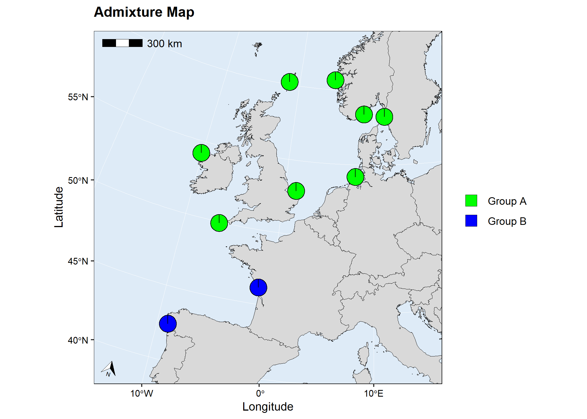

<!-- README.md is generated from README.Rmd. Please edit that file -->

# mapmixture

<!-- badges: start -->

[](https://github.com/Tom-Jenkins/mapmixture/actions/workflows/R-CMD-check.yaml)
<!-- badges: end -->

`mapmixture` is an R package and shiny app that enables users to
visualise admixture as pie charts on a projected map or as traditional
STRUCTURE barplots or facet barplots.

## Installation

You need to have [R](https://www.r-project.org/) (\>= 4.1.0) installed
on your system. Click
[here](https://cran.r-project.org/bin/windows/base/) to download the
latest version of R for Windows.

Install the latest development version from GitHub:

``` r
# install.packages("devtools")
devtools::install_github("Tom-Jenkins/mapmixture")
```

## Examples

Run `mapmixture()` with using admixture format 1 and custom parameters:

``` r
# Load package
library(mapmixture)

# Admixture Format 1
file <- system.file("extdata", "admixture1.csv", package = "mapmixture")
admixture1 <- read.csv(file)

# Coordinates
file <- system.file("extdata", "coordinates.csv", package = "mapmixture")
coordinates <- read.csv(file)

mapmixture(admixture1, coordinates,
  cluster_cols = c("blue","green"),
  cluster_names = c("Group 1","Group 2"),
  crs = 3035,
  boundary = c(xmin=-15, xmax=16, ymin=40, ymax=62),
  pie_size = 1,
  pie_border = 0.3,
  pie_opacity = 1,
  land_colour = "#d9d9d9",
  sea_colour = "#deebf7",
  expand = TRUE,
  arrow = TRUE,
  arrow_size = 1,
  arrow_position = "tl",
  scalebar = TRUE,
  scalebar_size = 1.5,
  scalebar_position = "tl",
  plot_title = "Mapmixture Figure Format 1",
  plot_title_size = 12,
  axis_title_size = 10,
  axis_text_size = 8
)
```



Run `mapmixture()` with using admixture format 3 and custom parameters:

``` r
# Load package
library(mapmixture)

# Admixture Format 3
file <- system.file("extdata", "admixture3.csv", package = "mapmixture")
admixture3 <- read.csv(file)

# Coordinates
file <- system.file("extdata", "coordinates.csv", package = "mapmixture")
coordinates <- read.csv(file)

mapmixture(admixture3, coordinates,
  cluster_cols = c("blue","green"),
  cluster_names = c("Group 1","Group 2"),
  crs = 3035,
  boundary = c(xmin=-15, xmax=16, ymin=40, ymax=62),
  pie_size = 1,
  pie_border = 0.3,
  pie_opacity = 1,
  land_colour = "#d9d9d9",
  sea_colour = "#deebf7",
  expand = TRUE,
  arrow = TRUE,
  arrow_size = 1,
  arrow_position = "tl",
  scalebar = TRUE,
  scalebar_size = 1.5,
  scalebar_position = "tl",
  plot_title = "Mapmixture Figure Format 3",
  plot_title_size = 12,
  axis_title_size = 10,
  axis_text_size = 8
)
```



Run `structure_plot()` to plot a traditional STRUCTURE barplot:

``` r
# Load package
library(mapmixture)

# Admixture Format 1
file <- system.file("extdata", "admixture1.csv", package = "mapmixture")
admixture1 <- read.csv(file)

structure_plot(admixture1, type = "structure")
```



Run `structure_plot()` to plot a facet barplot:

``` r
# Load package
library(mapmixture)

# Admixture Format 1
file <- system.file("extdata", "admixture1.csv", package = "mapmixture")
admixture1 <- read.csv(file)

structure_plot(admixture1, type = "facet", facet_col = 3)
```


## Shiny web server

<https://tomjenkins.shinyapps.io/mapmixture/>

## Format

``` r
# Load package
library(mapmixture)

# Admixture Format 1
file <- system.file("extdata", "admixture1.csv", package = "mapmixture")
admixture1 <- read.csv(file)
head(admixture1)
#>     Site   Ind Cluster.1 Cluster.2
#> 1 Bergen Ber01    0.9999     1e-04
#> 2 Bergen Ber02    0.9999     1e-04
#> 3 Bergen Ber03    0.9999     1e-04
#> 4 Bergen Ber04    0.9999     1e-04
#> 5 Bergen Ber05    0.9999     1e-04
#> 6 Bergen Ber06    0.9999     1e-04

# Admixture Format 2
file <- system.file("extdata", "admixture2.csv", package = "mapmixture")
admixture2 <- read.csv(file)
admixture2
#>                Site              Ind Cluster.1  Cluster.2
#> 1            Bergen           Bergen 0.9675212 0.03247879
#> 2            Cromer           Cromer 0.8217114 0.17828857
#> 3        Flodevigen       Flodevigen 0.9843806 0.01561944
#> 4         Helgoland        Helgoland 0.9761543 0.02384571
#> 5         Ile de Re        Ile de Re 0.3529000 0.64710000
#> 6   Isles of Scilly  Isles of Scilly 0.5632444 0.43675556
#> 7           Lysekil          Lysekil 0.9661722 0.03382778
#> 8  Mullet Peninsula Mullet Peninsula 0.5316833 0.46831667
#> 9          Shetland         Shetland 0.5838028 0.41619722
#> 10             Vigo             Vigo 0.2268444 0.77315556

# Admixture Format 3
file <- system.file("extdata", "admixture3.csv", package = "mapmixture")
admixture3 <- read.csv(file)
admixture3
#>                Site              Ind Cluster.1 Cluster.2
#> 1            Bergen           Bergen         1         0
#> 2            Cromer           Cromer         1         0
#> 3        Flodevigen       Flodevigen         1         0
#> 4         Helgoland        Helgoland         1         0
#> 5         Ile de Re        Ile de Re         0         1
#> 6   Isles of Scilly  Isles of Scilly         1         0
#> 7           Lysekil          Lysekil         1         0
#> 8  Mullet Peninsula Mullet Peninsula         1         0
#> 9          Shetland         Shetland         1         0
#> 10             Vigo             Vigo         0         1

# Coordinates
file <- system.file("extdata", "coordinates.csv", package = "mapmixture")
coordinates <- read.csv(file)
coordinates
#>                Site   Lat    Lon
#> 1            Bergen 60.65   4.77
#> 2            Cromer 52.94   1.31
#> 3        Flodevigen 58.42   8.76
#> 4         Helgoland 54.18   7.90
#> 5         Ile de Re 46.13  -1.25
#> 6   Isles of Scilly 49.92  -6.33
#> 7           Lysekil 58.26  11.37
#> 8  Mullet Peninsula 54.19 -10.15
#> 9          Shetland 60.17  -1.40
#> 10             Vigo 42.49  -8.99
```
